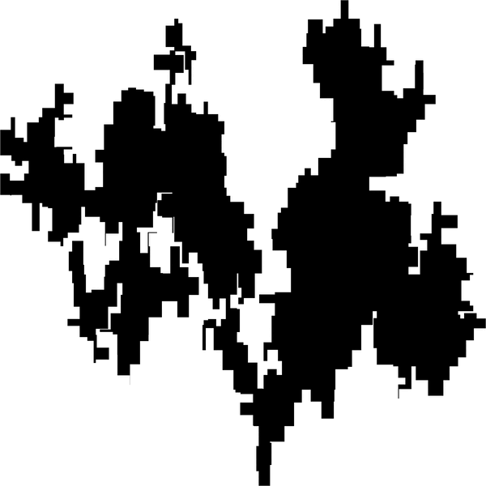

# Advent of Code 2023 in Ada and :new: Rust! :crab: and even some :new: Modula-2!

[](ada_logo.svg)

Because 5 years of pain and suffering aren't enough. :grin:
This year features an attempt to implement the same algorithm
in both Ada and Rust.
For fun, I throw in some Modula-2 from time to time...
well, at least ~~once~~ twice.

* [Mathematics and Computer Science](#mathematics-and-computer-science): Some interesting mathematical topics in this year's puzzles
* [Ranking of problems by difficulty](#ranking-of-problems-by-difficulty)
* Problems in order of appearance
   * :rocket: [Day 1](#day-1-trebuchet): Trebuchet?!
   * :package: [Day 2](#day-2-cube-conundrum): Cube Conundrum
   * :gear: [Day 3](#day-3-gear-ratios): Gear Ratios
   * :ticket: [Day 4](#day-4-scratchcards): Scratchcards
   * :seedling: [Day 5](#day-5-if-you-give-a-seed-a-fertilizer): If You Give A Seed A Fertilizer
   * :stopwatch: [Day 6](#day-6-wait-for-it): Wait For It
   * :camel: [Day 7](#day-7-camel-cards): Camel Cards
   * :desert: [Day 8](#day-8-haunted-wasteland): Haunted Wasteland
   * :palm_tree: [Day 9](#day-9-mirage-maintenance): Mirage Maintenance
   * :loop: [Day 10](#day-10-pipe-maze): Pipe Maze
   * :stars: [Day 11](#day-11-cosmic-expansion): Cosmic Expansion
   * :hotsprings: [Day 12](#day-12-hot-springs): Hot Springs
   * :mirror: [Day 13](#day-13-point-of-incidence): Point of Incidence
   * 📡 [Day 14](#day-14-parabolic-reflector-dish): Parabolic Reflector Dish
   * 🔎 [Day 15](#day-15-lens-library): Lens Library
   * :mirror: [Day 16](#day-16-the-floor-will-be-lava): The Floor Will Be Lava
   * :shopping_cart: [Day 17](#day-17-clumsy-crucible): Clumsy Crucible
   * :volcano: [Day 18](#day-18-lavaduct-lagoon): Lavaduct Lagoon
   * :stuffed_flatbread: [Day 19](#day-19-aplenty): Aplenty
   * :radio_button: [Day 20](#day-20-pulse-propagation): Pulse Propagation
   * :walking: [Day 21](#day-21-step-counter): Step Counter
   * :bricks: [Day 22](#day-22-sand-slabs): Sand Slabs
   * :evergreen_tree: [Day 23](#day-23-a-long-walk): A Long Walk
   * ⛈️ [Day 24](#day-24-never-tell-me-the-odds): Never Tell Me The Odds
   * :snowflake: [Day 25](#day-25-snowverload): Snowverload

## Mathematics and Computer Science

The following advanced concepts of mathematics and computer science
showed up either in the puzzles or in my solutions to them:

1. Modularity -- OK, maybe this isn't "advanced", but after completing the puzzles:
   * In Ada, I went back and created a `Common` package that contains code
     that I kept re-using; in particular, `Location_Record` and `Map_Array`
     and `Read_Input` for two-dimensional maps. I'm rather pleased with the result.
     Unfortunately, `gnatdoc` isn't the greatest system for documenting it.
1. [Programming by contracts](https://en.wikipedia.org/wiki/Design_by_contract)
   (not as much as I'd have liked)
1. Subtypes and ranges (Ada and Modula-2 only; Rust doesn't offer this feature)
1. [Functional-style programming](https://en.wikipedia.org/wiki/Rust_(programming_language)#Iterators)
   (mostly Rust, but Ada has some offerings; e.g., `'Reduce`)
1. Interval arithmetic (mostly set operations)
1. Mathematical modeling
1. Quadratic formula
1. Integer sequences that reduce to arithmetic sequences
   (there's a term for this, but I can't recall it offhand;
   see the [Day 9](#day-9-mirage-maintenance) puzzle)
1. [Search algorithms](https://en.wikipedia.org/wiki/Search_algorithm)
1. [Dynamic programming](https://en.wikipedia.org/wiki/Dynamic_programming)
1. Detecting patterns of numerical sequences
1. [Euclid's algorithm](https://en.wikipedia.org/wiki/Euclidean_algorithm)
   for greatest common divisors and using them to compute least common multiples
1. [Pick's Theorem](https://en.wikipedia.org/wiki/Pick's_theorem) and the
   [Shoelace Formula](https://en.wikipedia.org/wiki/Shoelace_formula)
1. Gröbner bases [(yes, really)](#day-24-never-tell-me-the-odds)
1. [Monte Carlo methods](https://en.wikipedia.org/wiki/Monte_Carlo_method)
1. [Karger's Theorem](https://en.wikipedia.org/wiki/Karger's_algorithm)

## Ranking of problems by difficulty

This is inherently subjective,
and I may even misremember how difficult I found a problem,
so if you disagree, at least check out the justification I give
in the relevant day's **Experience** section.

### :star_struck: Quick 'n easy puzzles

C'mon, you can do these.

* :rocket: [Day 1](#day-1-trebuchet): Trebuchet?!
* :package: [Day 2](#day-2-cube-conundrum): Cube Conundrum
* :gear: [Day 3](#day-3-gear-ratios): Gear Ratios
* :ticket: [Day 4](#day-4-scratchcards): Scratchcards
* :stopwatch: [Day 6](#day-6-wait-for-it): Wait For It
* :camel: [Day 7](#day-7-camel-cards): Camel Cards
* :palm_tree: [Day 9](#day-9-mirage-maintenance): Mirage Maintenance
* :stars: [Day 11](#day-11-cosmic-expansion): Cosmic Expansion
* 🔎 [Day 15](#day-15-lens-library): Lens Library

### :thinking: Puzzles needing more than a little thought

* :seedling: [Day 5](#day-5-if-you-give-a-seed-a-fertilizer): If You Give A Seed A Fertilizer
* :desert: [Day 8](#day-8-haunted-wasteland): Haunted Wasteland
* :mirror: [Day 13](#day-13-point-of-incidence): Point of Incidence
* 📡 [Day 14](#day-14-parabolic-reflector-dish): Parabolic Reflector Dish
* :mirror: [Day 16](#day-16-the-floor-will-be-lava): The Floor Will Be Lava
* :shopping_cart: [Day 17](#day-17-clumsy-crucible): Clumsy Crucible
* :stuffed_flatbread: [Day 19](#day-19-aplenty): Aplenty
* :radio_button: [Day 20](#day-20-pulse-propagation): Pulse Propagation
* :bricks: [Day 22](#day-22-sand-slabs): Sand Slabs

### :fearful: Problems requiring a lot of thought, or trickier ideas

A reputable mathematics or computer science program
will teach you how to solve these problems,
but you've probably used it often enough to forget the technique.
Or, it's not something they teach in school,
but a little imagination will get you to the solution.

* :loop: [Day 10](#day-10-pipe-maze): Pipe Maze
* :hotsprings: [Day 12](#day-12-hot-springs): Hot Springs
* :walking: [Day 21](#day-21-step-counter): Step Counter
* :evergreen_tree: [Day 23](#day-23-a-long-walk): A Long Walk

### :scream: Great puzzles that are jes' plain ornery

If you know the trick, the solution is easy.
But knowing the trick is unusual,
and while I was able to come up with a solution,
implementing it was tricky and frustrating.

* :volcano: [Day 18](#day-18-lavaduct-lagoon): Lavaduct Lagoon
* :snowflake: [Day 25](#day-25-snowverload): Snowverload

### :sob: What was the puzzle master thinking?!?

This question left a lot of the pros baffled, and not a few of them miffed!
Most solutions I saw relied on asking a theorem prover to solve it.
(Or Mathematica... but I repeat myself.)

* ⛈️ [Day 24](#day-24-never-tell-me-the-odds): Never Tell Me The Odds


## Day 1: Trebuchet?!
<span style="font-size: 8ex;">:rocket:</font>

The elves have decided you need to fix the lack of snow.
Their solution is to catapult you into the sky via a trebuchet.

This has the most entertaining paragraph I recall in Advent of Code:

> You try to ask why they can't just use a weather machine ("not powerful enough")
> and where they're even sending you ("the sky")
> and why your map looks mostly blank ("you sure ask a lot of questions")
> and hang on did you just say the sky ("of course, where do you think snow comes from")
> when you realize that the Elves
> are already loading you into a trebuchet ("please hold still, we need to strap you in").

The problem depends on **calibration values**,
which are the first and last "digits" to appear in a string.

1. Sum the calibration values, where "digit" means `1..9`.
1. Sum the calibration values, where "digit" now includes the spellings
   (`one`, `two`, ...)

### Unusual tools

* Ada: contracts on the `Digit` function
  (sure would be nice if Ada had a `To_Digit` function the way Rust does)
* Modula-2: just using Modula-2 these days was unusual enough
* Rust: Aho-Corasick

### Experience

#### Ada and Rust

This is the first time I use Aho-Corasick in Rust,
and as with many things Rust, there was quite the learning curve.

Since I'm using Aho-Corasick in Rust, the algorithms aren't quite the same.
The Ada uses a sequence of `if`-`then` statements
and converts each character or string to a digit.

Speed-wise, the two are more or less the same.
The Rust is a little faster, but (a) I'm running it in release mode,
while I'm running Ada at whatever gnat's default optimization level is, and
(b) Ada is checking the contracts for the `Digit` function.

#### Modula-2

This is my first non-trivial Modula-2 program in about 3 decades.
While it was fun to work with it in principle,
I encountered several issues that Ada and/or Rust would have prevented.
Of course, it's possible that Modula-2 offers a convenient way to do this,
and I just don't know about it.

1. Standard Library?

   The default library for gm2 is based on PIM,
   Niklaus Wirth's "Programming in Modula-2" specification.
   The ISO standard is different in some areas,
   such as string comparison:
   PIM, like C's string comparison, returns an integer,
   while ISO defines and returns a proper type.
   Fortunately, gnu Modula-2 offers the option
   to compile against the ISO libraries.
1. Uninitialized variables?

   I spent _way_ too long debugging an error where I was returning an uninitialized variable.
   Rust requires you to initialize all variables,
   and while Ada doesn't (!!!) it does allow you to specify initial values.
1. Inconvenient initialization?

   Both Ada and Rust allow you to initialize a variable when you declare it.
   Not so with Modula-2; you must wait until the body (`BEGIN`)...
   which means you may forget to initialize it.
1. String Comparisons? Substrings?

   Ada and Rust allow easy string comparison and substrings.
   Modula-2 does not, or at least I couldn't find a way.
   _[update:
   [Confirmed on gm2 mailing list](https://lists.nongnu.org/archive/html/gm2/2023-12/msg00003.html)
   by the lead compiler developer, though he did point me
   to the compiler-supplied `DynamicStrings` module.]_
   I had to declare and fill in a temporary variable instead
   (`Candidate`).
1. Incorrect handling of constants of variant records?

   When I tried to initialize a constant of a variant record type,
   the compiler absolutely refused to handle it, saying it was an unknown field.
   I suspect it was a compiler bug.
   I will try to look into this more and possibly report it.
   _[update:
   [Confirmed on gm2 mailing list](https://lists.nongnu.org/archive/html/gm2/2023-12/msg00012.html)
   that this is a bug.]_

Somewhat surprisingly, the compiled code is several times slower
than unoptimized Ada and Rust, even when optimized with `-Ofast` and `-flto`.

## Day 2: Cube Conundrum
<span style="font-size: 8ex;">:package:</span>

You're on an island in the clouds, walking along with an elf
who plays games with cubes.

1. Sum the indices of the games that satisfy bounds on the colored cubes.
1. Sum the powers of the minimum bounds on each game to make it valid.

### Unusual Tools

* Rust: pest crate, for parsing the input

### Experience

The Rust took a lot longer to write because I had to figure out the pest crate,
but I think it makes the top-level code easier to read, though
I'm not so sure about `TryFrom<Pair> for Set`.

## Day 3: Gear Ratios
<span style="font-size: 8ex;">:gear:</span>

You need to get your gondola going!

1. Sum the values of the parts in the schematic.
   Parts are the numbers that are adjacent to a non-period, non-decimal symbol.
1. Sum the gear "ratios".
   Gears are the numbers adjacent to `*` symbols
   that have _only_ two numbers adjacent to them.

### Unusual tools

1. In Ada I was able to define a useful `Constraints` range type,
   though it made life a little annoying at one point.
1. In Rust:
   * I decided to go with an array, to mimic the Ada,
     rather than to use vectors.
   * Unlike Ada, this part 2 uses a state machine (`Locations`)
     to move through the known states of a potential gear.

### Experience

#### Ada

Kind of surprised I got this one right pretty quickly.

#### Modula-2

Translating from Ada was pretty straightforward.
It's interesting to me that you can define a variable
to be of a certain range type,
but Modula-2 won't choke if it goes outside that range
the way Ada will (unless this is a bug in gm2).
I'm definitely appreciating some of Ada's safety features,
since the lack of them in Modula-2 hammered me a few times.
In particular:
* Can't seem to define a constant type of a variant record.
  I'm not sure if that's a misunderstanding on my part,
  or a bug in gm2.
* I'm pretty sure this is a bug:
  if you neglect the parentheses on a function procedure
  that takes no parameters, gm2 treats it as if you want the address(?).
  Hence, the following line of the module repeatedly gave the wrong answer:
      InOut.WriteInt(Part1, 0); (* needs to be Part1() *)
 
_[update: [Confirmed by lead compiler developer](https://lists.nongnu.org/archive/html/gm2/2023-12/msg00012.html)
that this is a bug.]_
    
#### Rust

Man, this took a while.
I **really** missed having access to Ada's custom array indices,
and it's also a lot harder in Rust to check indices.
In Ada, I can do this:
    for Row_Offset in -1 .. 1 when Row + Row_Offset in Constraints loop
       -- ...
       if CH.Is_Decimal_Digit
              (Schematic (Row + Row_Offset) (Col + Col_Offset))

...but in Rust I have to do something like this:
    (-1..2).filter(|offset| (0..MAX_IDX).contains(&(row + offset)))
       // ...
       self.schematic[(row + row_offset) as usize]
                      [(col + offset) as usize]
                .is_ascii_digit()
...unless my Rust is even worse than I thought.
Notice the conversions in Rust: in the first case,
I'm using `i32` because otherwise it will refuse to compile
the sum of a `usize` and the `-1` that begins the range;
then, I have to convert the sum to a `usize`
in order to index into the array.
There's also the annoyance
(which made me waste quite a bit of time debugging)
where `(-1..1)` indicates the numbers -1 and 0, **not** 1.
This is why I have `(-1..2)` above.
All in all, I wasn't expecting the Rust to be harder to write
and more annoying to look at and debug than the Ada.
  
## Day 4: Scratchcards
<span style="font-size: 8ex;">:ticket:</span>

An elf can help you, but (as usual) first he wants a favor.
He has a bunch of scratchcards with numbers written on them,
and he scratches off the values to see which numbers he has.

1. If he receives 2^(n - 1) points on a card with n matches,
   how many points does he win?
1. Oops! (funny how often we say that in the Advent of Code...)
   He _doesn't_ receive points; instead, he receives copies of cards.
   If card i has m matches, then he receives a new copy of cards
   i + 1, i + 2, ..., i + m. How many cards does he have at the end?

### Unusual tools

1. It still tickles me pink to use Ada 2022's `'Reduce`.

### Experience

#### Ada

Pretty pleased with how quickly I worked this out in Ada.
A silly typo held me up on Part 2:

      Copies (Ith + Offset) := (@ + 1) * Copies (Ith);

That leads to a **lot** of cards, already by card 5 or 6!

<span style="font-size: 8ex;">:astonished:</span>

#### Rust
The Rust was also pretty straightforward. I got hung up on three things:
* I first tried to `.split` the input strings on a ` `, but
  somehow that led to empty strings in the input.
  I never looked into what I was doing wrong because `.split_ascii_whitespace`
  did the job.
* 0-based indexing meant I was off-by-one
  when I used `.skip(card)` in part 2.
  Fixed by using `.skip(card + 1)`.
* I botched the initial filter in `matches`,
  forgetting what types I was looking at.

## Day 5: If You Give A Seed A Fertilizer
<span style="font-size: 8ex;">:seedling:</span>

Yet another elf who's willing to help you,
though of course he wants a favor first.
He seems oddly unashamed of how long he's overlooked sending water.

1. help an elf figure out which of 20 seeds to plant
   by following an almanac's mapping of seed to soil,
   soil to fertilizer, etc.
2. whoops! **(this is getting to be a habit...)**
   it's not 20 seeds, but 10 seeds and 10 intervals;
   do it again with this understanding

### Unusual tools

* I hadn't used Ada's `Containers.Generic_Array_Sort` in a while.
  In fact, I couldn't even find it when searching previous AoC's,
  though I did search for `Sorter` instead of `Sort`.
  Amazingly, I instantiated the generic correctly on the first try!
* Interval operations, in particular intersections and/or partitions.
* :warning: 128-bit integers (`Long_Long_Integer` in Ada) as the Ada standard
  sets 32-bit integers as the default ( `-2\*\*15 + 1 .. 2\*\*15 - 1`).
  My initial reaction was amazement
  ("Who would ever need a value greater than 4 billion or so?")
  but [Jeffrey Carter set me straight](https://forum.ada-lang.io/t/2023-day-5-if-you-give-a-seed-a-fertilizer/574/11?u=cantanima).
  Some future solutions will have custom types.

### Experience

* Despite the huge numbers, I was able to solve both parts via brute force.
  Part 2 will take a while! while I waited,
  I thought about how to tackle it efficiently, and hey, hey!
  I came up with the approach implemented here:
  splitting intervals when they overlap a mapping
  without containing or being contained.
  
  Before I could implement it, the brute force approach terminated
  _with the correct answer!_
  
  <span style="font-size: 8ex;">:astonished:</span>
  
  I pressed on out of a desire to have a _good_ solution, and
  once I wrung out the bugs, the correct answer popped up.
  This is much, _much_ faster, something like 9 milliseconds,
  as opposed to 9 minutes, or however long it took
  the inefficient solution to do its thing.
* The Rust implementation is about half as many lines as the Ada implementation.
  I'm not sure why that is, but a non-trivial part of it is:
  * formatting
  * more detailed comments in the Ada
  * the Rust lacks the brute-force implementation of Part 2
  * it takes a few more lines to set up certain library structures in Ada;
    compare, for instance, instantiation of Ada's `Interval_Vectors` package
    as opposed to Rust's inline declaration of the `Vec<Interval>`.

## Day 6: Wait For It
<span style="font-size: 8ex;">:stopwatch:</span>

You need some sand, and Desert Island seems like a good place to find some.
But how should you get there? Oddly, you can't just ask any of the elves
hanging around, pointing out that you need to save Christmas, nooooo.
You have to finagle your way onto a ferry. But you have no money, apparently.
Fortunately, you can win an all-expenses-paid ferry ride there, if only
you manage to win at the boat races.

In these boat races, you press a button on top of the boat for x milliseconds,
which increases the speed the boat travels, then you release it to travel
the remaining time allotted to the race. You need to make a good distance.

1. How many different options do you have to press it a whole number of seconds
   and beat the current distance record in each race?
2. whoops! ( :roll_eyes: ) those weren't the records in separate races;
   they were the records in one race, but printed out with, **and I quote**,
   "very bad kerning". :rofl: :rofl: :rofl: :rofl: Rinse, lather, repeat.

### Unusual Tools

1. I haven't used Ada's floating-point packages in so long,
   I forgot everything there was to using them.

### Experience

Hey, it's the quadratic formula! :heart:
It only took me an embarrassingly long time
to line up the data and the coefficients!

This was surprisingly easy for a Day 6.
I can see how it could easily go awry for someone who didn't check for
the edge case, or who didn't recall how the decimal system works.

#### Ada

Satisfying the compiler in Part 2 was tedious, but not especially hard.

#### Rust

Translating the Ada to Rust was straightforward.

## Day 7: Camel Cards
<span style="font-size: 8ex;">:camel:</span>

You're playing cards with an elf on a camel, whiling away the time
as it transports you across Desert Island. It's a bit like poker.

1. Determine the point values of the many, many hands you're dealt.
   This requires ranking them.
1. The elf introduces new rules. Determine the new point values.

### Unusual tools

#### Ada
* Part 1 uses an enumeration's default ordering to break ties between hands.
* Part 2 uses an array over an enumeration to re-order individual cards,
   allowing us to reuse the same basic structure:
   ```
   New_Ranking : constant array (Face) of Natural :=
      [Jack => 0, One => 1, Two => 2, Three => 3, Four => 4, Five => 5,
      Six   => 6, Seven => 7, Eight => 8, Nine => 9, Ten => 10, Queen => 11,
      King  => 12, Ace => 13];
   ```

#### Rust

Man! was this a chore.

* Rust gives you nothing for free, which I don't necessarily mind,
  but having to derive

      Clone, Copy, PartialEq, Eq, Hash, PartialOrd, Ord
  
  on the `Face` type seemed a bit much.
  This is one drawback to Rust's conflating ordinary enumerations
  with algebraic types.
* On the other hand (no pun intended), at least Rust _lets_ me derive `Hash`.
  Ada doesn't offer a way to derive hash functions recursively for records
  whose fields are of types that already have known hash functions.
  Not as far as I know, anyway.
* I wasted time trying to `impl PartialOrd for Hand`,
  then getting confused and trying to `impl Ord for Hand`,
  then getting more confused because `Ord` wants a `clamp`
  and the code completion filled it in with something even _it_ didn't like,
  all the time wondering what I would do in Part 2 when I had to change ordering,
  before I realized that I could simply `.sort_by()` and supply the desired ordering.
  Granted, that stupidity is on _me_; I knew there was a `.sort_by()` and simply forgot about it.
  Still, it was a chore, and implementing `Ord::clamp()` still scares me.
* In part 1 I was nailed by the fact that counting always starts from 0,
  and you have no way to change it,
  so you _must_ remember to add 1 to `ith` (my default indexing variable)
  when you multiply it to the bid.
* Rust does have a nice _[...eep. I seem to have forgotten whatever I wanted to write here!]_

### Experience

* This was straightforward to do in Ada, thanks to arrays,
  sensible defaults for things like orderings,
  and the ability to index in a manner appropriate to the problem.
* It was not quite so straightforward in Rust,
  for the reasons mentioned above.

## Day 8: Haunted Wasteland
<span style="font-size: 8ex;">:desert:</span>

Today's introduction manages to be both melancholy and spooky.

    You're still riding a camel across Desert Island
    when you spot a sandstorm quickly approaching.
    When you turn to warn the Elf, she disappears before your eyes!
    To be fair, she had just finished warning you about ghosts a few minutes ago.

As we will see, the simultaneity of these emotions is appropriate to the puzzle.

Meanwhile, there's that sandstorm.
You need to find your way to the destination.
The ghost seems to have left you some maps.

1. How many steps does it take to get from `AAA` to `ZZZ`?
1. How many steps does it take to get from any node ending in `A`
   to any node ending in `Z`?

### Unusual tools

Nothing special.

### Experience

#### Ada
If I hadn't incremented `Step` in the wrong place,
both parts would have been fun and easy, but
in Part 2 I incremented `Step` after moving _each_ ghost,
rather than after moving _all_ ghosts.
That left me unable to confirm my suspicion that
they were moving in regular cycles, and we needed an `Lcm`
(which I duly copied from AoC 2019 Day 12).

Otherwise, it was fun and easy.

Out of curiosity, while it makes sense that
ghosts can move in many places simultaneously...
how am _I_ supposed to do so?
Tune in tomorrow to find out! (I guess)

#### Rust
* `read_input()`is nearly 80 lines of Rust.
* `Read_Input` is less than 30 lines of Ada.

**On the other hand!**
* The Rust is fewer lines overall, in part because...
* ...I used the `num` crate to compute `lcm`'s, where in Ada
  I simply copy-and-pasted my `lcm` code from a previous year's puzzle,
  as noted above.

**On the other other hand!**
Compare this Rust...

    n = if direction == Direction::Left {
       map[&n].left
    } else {
       map[&n].right
    };

...to this Ada.

    N := Map (N) (D);

**We report, you decide.**

## Day 9: Mirage Maintenance
<span style="font-size: 8ex;">:palm_tree:</span>

For yesterday's puzzle I commented

> Out of curiosity, while it makes sense that
ghosts can move in many places simultaneously...
how am _I_ supposed to do so?
Tune in tomorrow to find out! (I guess)

Nope. We never found out "how".

After the sandstorm, you come upon an oasis.
Above you is a metal island, probably named Metal Island.
While awaiting the sunrise, you take some ecological readings
which produce sequences of values.

1. Predict the future of the oasis by extending the sequences
   one value to the right. Return the new values' sum.
1. Infer the history of the oasis by extending the sequences
   one value to the left. Return the new values' sum.

### Unusual Tools

* In Ada, I finally took Jeffrey Carter's advice and defaulted to using
  a custom Integer range: `type Value is range -2**32 .. 2**32 - 1;`

### Experience

Oddly fun and easy for a day 9. Initially I goofed on Part 2
by adding the wrong numbers, but that was because
I was modifying the former `Extend_Sequence` to be more general.

#### Rust

* The only mistake I made with the Rust was to forget
  that the data could be negative, so I stupidly used `u64` instead of `i64`.
* This is one of those occasions where the Rust is much shorter than the Ada,
  thanks in no small part to
  * **less boilerplate**
    
    The Ada code spends at least 10 lines defining
    `Value_IO`, `Sequence_Vectors`, `Sequence_Sequences`.
    Those basically don't exist in the Rust code.
    There are other examples of this.
  * **easier iteration**
    
    Rust's functional-style iteration played a huge role in
    `extend`, `part_1`, and `part_2`.
    I could arguably do something similar in Ada's
    `Part_1` and `Part_2` by employing `Reduce` with a custom reducer,
    but I don't believe it's possible to do so with `Extend` --
    or whether it's desirable even if it is.
* The Rust is also significantly faster than the Ada: 6ms vs. 36ms.
  I will try to investigate this at some point.
  (As of 26 Dec 2023 I have not.)

## Day 10: Pipe Maze
<span style="font-size: 8ex;">:loop:</span>

As you make your way around metal island, you spot a (metal) animal
who ducks into a pipe.
But you need his help!

1. Trace the closed-loop pipe. Determine how many steps it takes
   to get to its furthest point.
1. Determine the size of a potential nest within the closed loop.

### Unusual Tools

#### Ada
* Ada 2022's `declare` expressions, in `Can_Move`.
  Unfortunately, the language plugin for VSCode doesn't recognize these yet,
  so formatting was a hassle.
* Exception handling, at least during debugging.

### Experience

This is much more complex than the previous puzzles.
* Some sort of search in Part 2.
* _That_ needs to detect points outside the loop but accessible to the animal
  by squeezing between pipes.
* The pipe shapes are a little hard to work out.
* If you get something wrong, debugging can be a hassle.

Still, I made it harder than it needed to be.
* In my first attempt at Part 1, searching terminated by testing whether
  the two copies of the animal that follow the pipe in opposite directions
  are the same.
  **That was dumb.**
  I needed only to check whether their _locations_ were the same.
* In my first attempt at Part 2, I forgot the puzzle master's note that
  "[a]ny tile that isn't part of the main loop
   can count as being enclosed by the loop."

All that aside, it's a very good puzzle.
I just hope we get some easier ones the next couple of days. :grin:

#### Rust

Translating this was _not_ as straightforward as I would have liked.
One big problem was, again, the enforcement of 0-based indexing.
I also overlooked minor details when it came to the flood fill.

### Visualization

Finally! our first visualization of the year.


## Day 11: Cosmic Expansion
<span style="font-size: 8ex;">:stars:</span>

You come upon an observatory, where
a researcher offers to help you as soon as he finishes his research project.
He has an image of part of the universe,
and wants to sum the distances between the observed galaxies.

1. Do this after doubling each row or column of empty space.
1. The universe is older than that.
   Instead of replacing each row or column by two,
   replace by one million.

### Tools

#### The puzzle itself

Just a bit of cleverness.

#### Rust


### Experience

Fun and, after yesterday, gratifyingly easy.
While writing the Rust, I noticed a way to improve the Ada.

#### That aside, what happened to the animal?

We spent yesterday trying to find its nest, and
today there's not so much as a word breathed about it.
I still miss the ghost from Days 7 and 8,
and now I lose the animal, too?

Completing the Advent of Code is sometimes like reading a Neil Gaiman story:
one day you meet intriguing, sympathetic characters,
and the next day they're forgotten, dropped from the story and unremembered,
as if they never really mattered.

:cry:

## Day 12: Hot Springs
<span style="font-size: 8ex;">:hotsprings:</span>

Someone didn't keep track of damaged bedsprings very well.
You have to help an elf fix 'em.

1. How many ways can the records of conditions for each spring be reconciled
   with the records of sequences of damaged springs?
1. Whoops! (**not that again...**) The records spring free, quintupling!
   Repeat Part 1 with the quintupled records.

### Tools

1. Sleeping after finishing Part 1.
1. Reading other people's approaches.
1. Recalling Dynamic Programming.
1. A sliding window of damaged springs.

### Experience

I had forgotten about dynamic programming, so this took me a long while,
even after visiting the Reddit solutions page gave me some insight.
I rather like the solution I eventually came up with.

#### Ada

As I commented in the source code at one point,

    --  note that indexing is done relative to First'First and First'Last,
    --  only one of many reasons why Ada is Awesome.
    --  leave the zero-based indexing insanity to the compiler!

#### Rust

Geez, could Rust use non-0-indexed arrays.
I spent more than an hour trying to debug the thing,
not because I didn't know what the problem was -- bad indexing --
but because I was looking in the wrong place.

## Day 13: Point of Incidence
<span style="font-size: 8ex;">:mirror:</span>

You are walking through a landscape of rocks and ash!
Mirrors are strewn about the landscape!
Since the rocks and ash are the same color,
the mirrors make it hard to navigate around the rocks!

1. For each mirror, find the single row or column of symmetry,
   as it corresponds to a mirror.
2. Whoops! (:thinking:) The mirrors are smudged!
   Amazingly enough, they each have exactly one smudge!
   For each mirror, find the single position that, when changed,
   gives you a _new_ mirror; i.e., a _new_ row or column of symmetry.

### Unusual tools

#### Ada

* Originally I declared the `Finalize` subprogram within `Read_Input`.
  However, that looked ugly, so after cleaning up, I made it more conventional.
* After implementing the Rust, I went back and re-did the Ada using
  Ada 2012's quantified expressions and Ada 2022's `declare` expressions
  and `'Reduce` expressions.
  I ended up like the result very much.
  Some of it's very much clearer; other parts are at worst comparable, I think.
* The `'Reduce` expression uses a custom accumulator type and reduction function!
* In the process, I noticed that the `Object` type
  used a custom `Repr` function for output...
  but Ada 2022 allows one to define a custom `'Image` attribute,
  so I did that, too!

#### Rust

* Use of `Option` type.
  The Ada code does something similar with a discriminated type,
  but it doesn't have the `Option` syntax.
* `impl Display for Object`
* I tried to implement `detect_horizontal_axis()` functionally at first,
  but really struggled on account of array indexing.
  Debugging was difficult in the functional style, so
  I switched to something more traditional.
  Once I debugged it, I "translated" the result to functional,
  and kept both.

### Experience

This was a bit tricky to implement. I made some dumb mistakes along the way,
especially as regards loop termination and retention of values.
Despite that, I enjoyed it.

#### Comparison of Ada and Rust, Part 1

IMHO Ada looks better in this example.

**Ada 2022**

      for Row in 2 .. M'Last (1) loop
         if (for all Offset in 1 .. Natural'Min (Row - 1, M'Last (1) - Row + 1) =>
              (for all Col in 1 .. M'Last (2) =>
                 M (Row - Offset, Col) = M (Row + Offset - 1, Col)))
         then
            return Axis_Of_Symmetry'(Valid => True, Value => Row - 1);
         end if;
      end loop;
      return Axis_Of_Symmetry'(Valid => False);

      --  ...

      for Col in 2 .. M'Last (2) loop
         if (for all Offset in 1 .. Natural'Min (Col - 1, M'Last (2) - Col + 1) =>
              (for all Row in 1 .. M'Last (1) =>
                 M (Row, Col - Offset) = M (Row, Col + Offset - 1)))
         then
            return Axis_Of_Symmetry'(Valid => True, Value => Col - 1);
         end if;
      end loop;
      return Axis_Of_Symmetry'(Valid => False);

(reformatted for a more apples-to-apples comparison w/the Rust)

**Rust via iterators &c.**

    map.values
        .iter()
        .enumerate()
        .skip(1)
        .find(|(row, _)| {
            (1..=*row.min(&(map.rows - row))).all(|offset| {
                (0..map.cols).all(|col| {
                    map.values[row - offset][col]
                        == map.values[row + offset - 1][col]
                })
            })
        })
        .map(|(row, _)| row)
    
    // ...

    (1..map.cols).find(|col| {
        (1..=*col.min(&(map.cols - col))).all(|offset| {
            map.values
                .iter()
                .all(|row| row[col - offset] == row[col + offset - 1])
        })
    })

#### Comparison of Ada and Rust, Part 2

On the other hand, there's something to be said for a solid`.find()` iterator.

**Ada 2022**

    type Inconsistency_Tracker is record
       M               : Map_Constant;
       Inconsistencies : Natural;
       Index             : Positive;
    end record;
 
    type Offset_Tracker is record
       Tracker : Inconsistency_Tracker;
       Offset  : Positive;
    end record;
 
    function Add_When_Different_Col
      (Accumulator : Offset_Tracker; Col : Natural)
    return Offset_Tracker is
      (declare
          M renames Accumulator.Tracker.M;
          Row renames Accumulator.Tracker.Index;
          Offset renames Accumulator.Offset;
       begin
       (Offset => Offset,
        Tracker =>
          (M => M, Index => Row,
           Inconsistencies => Accumulator.Tracker.Inconsistencies  +
             (if M (Row - Offset, Col) = M (Row + Offset - 1, Col)
             then 0
             else 1))));
 
    function Count_Row_Inconsistencies
      (Accumulator : Inconsistency_Tracker; Offset : Natural)
       return Inconsistency_Tracker
    is
    (Offset_Tracker'([for Col in Accumulator.M'Range (2) => Col] 'Reduce
       (Add_When_Different_Col, (Accumulator, Offset))).Tracker);
 
    function Find_Horizontal_Axis (M : Map_Constant) return  Axis_Of_Symmetry is
 
    begin
 
       for Row in 2 .. M'Last (1) loop
 
          declare
             Reduction : constant Inconsistency_Tracker
                := [for Offset in 1 .. Natural'Min
                      (Row - 1, M'Last (1) - Row + 1) => Offset] 'Reduce
                         (Count_Row_Inconsistencies,
                            (M => M, Inconsistencies => 0, Index  => Row));
          begin
             if Reduction.Inconsistencies = 1 then
                return Axis_Of_Symmetry'(Valid => True, Value =>  Row - 1);
             end if;
          end;
       end loop;
 
       return Axis_Of_Symmetry'(Valid => False);
 
    end Find_Horizontal_Axis;
 
...and that's just _one_ of them.

**Rust**

    map.values.iter().enumerate().skip(1)
    .find(|(row, _)| {
        (1..=*row.min(&(map.rows - row))).map(|offset| {
            (0..map.cols).filter(|col| {
                map.values[row - offset][*col] != map.values[row + offset - 1][*col]
            }).count()
        }).sum::<usize>() == 1
    }).map(|(row, _)| row)

    // ...

    (1..map.cols).find(|col| {
        (1..=*col.min(&(map.cols - col))).map(|offset| {
            (0..map.rows).filter(|row| {
                map.values[*row][col - offset] != map.values[*row][col + offset - 1]
            }).count()
        }).sum::<usize>() == 1
    })

## Day 14: Parabolic Reflector Dish
<span style="font-size: 8ex;">📡</span>

The reason lava isn't working right is that a reflector dish is off kilter.
We need to figure out how to reposition its platform.
However, the north beam is damaged...

1. Determine the load on the north beam when you tilt the reflector north.
1. Hey, there's a "spin cycle" button! Determine the load on the north beam
   after 1 billion spin cycles.

### Unusual Tools

Just a bit of math -- detecting the period of a regular sequence -- but
not even the arithmetic sum formula, my first suspicion when I read Part 1.

### Experience

Fun and relatively easy.

#### Ada. vs. Rust

~~The Rust is significantly faster:
less than a second, versus roughly 5 seconds for the Ada.
Nearly all of it occurs in Part 2.
I plan to look into this.~~

Well, that's embarrassing: I had forgotten that the Ada
was writing visualizations to disk.
Once I remove that, the Ada implementation is no longer markedly slower.

### Visualization

A visualization is possible, but I didn't find it particularly insightful.

## Day 15: Lens Library
<span style="font-size: 8ex;">🔎</span>

The dish is pointing light to the right place, but things still aren't right.
You need to adjust some lenses so that the focal power is correct.
The instructions to do that require you to work with the
**Holiday ASCII String Helper algorithm**, or HASH for short. :grin:

1. HASH the instructions to make sure you know what you're doing.
   Report the sum of HASH values.
1. Use the instructions to adjust the lenses. Report the focal power.

### Unusual Tools

#### Ada

* I finally (?) come to grips with the Ada 2022 construction

      Some_Array := [
        Some_Range => (
           for Ith of Some_Range => Do_Something_With (Ith)
        ),
        others => Default
      ]
  
  I realized later that the issue that required me to use this was   bad design,
  so I fixed that, and this is no longer in the code.
  But I did have it working!

* After implementing in Rust,

  * I changed `Part_1` to use `Ada.Strings.Maps.Character_Set`
    and `Ada.Strings.Fixed.Index`.

  * I also changed the `Hash` function to use a reducer:
   
           function Hash_Character
             (Accumulator : Hash_Tracker; Symbol : Character) return       Hash_Tracker is
             ((Value => ((Accumulator.Value + Character'Pos (Symbol)) *       17) mod 256));
           --  (Accumulator: Hash_Value; Symbol: Character) return       Hash_Value is
           --  (((Accumulator + Character'Pos (Symbol)) * 17) mod 256);
        
           function Hash (S : String) return Hash_Value is
              (Hash_Tracker'(S'Reduce (Hash_Character, (Value => 0))).      Value);
              --  (S'Reduce (Hash_Character, 0));
   
    The commented-out lines indicate my first attempt,
    which for some reason won't compile.

### Experience

The bad design on Part 2 was badly implemented, so that held me up a while.
Otherwise, fun and easy.

## Day 16: The Floor Will Be Lava
<span style="font-size: 8ex;">:mirror:</span>

We need to find where to direct the beam of light into the facility
that will maximize the number of tiles energized by light.

1. Try this when the beam enters from the top left and travels right.
1. Try it for all potential entrances (top/bottom rows, left/right columns)
   and report the maximum number of energized tiles.

### Unusual Tools

#### Ada

Finally tried a record delta aggregate:

    (P with delta Col => P.Col - 1, Dir => West)

`P` is a `Photon` that has only two fields, so in this case the delta aggregate
isn't so useful; initializing all three fields wouldn't have killed me.
When I first used it, though, I'd forgotten to change the direction, so
it made more sense at the time.

#### Rust

1. Tired of dealing with index errors, I implemented the `Index` trait
   several times here:
   * `impl Index<Direction> for Deltas` with `Output = Diff2Dim`
   * `impl Index<Direction> for EnergizedDir` with `Output = bool`
   * `impl IndexMut<Direction> for EnergizedDir`

   ...as well as a couple of other instances that were deleted during cleanup.
   That enabled me to write code like this:

       energized[photon.row as usize][photon.col as usize][photon.dir]
   
   ...where that last index (`[photon.dir]`) is accessing according to an enumeration.
1. As the previous item implies, I decided to get around the annoying feature
   where Rust panics when you add `0_usize - 1` by recording indices as `i8`,
   so that I can check manipulate `phonon.row` without too much worry;
   e.g., `(0..SIDE_LENGTH).contains(&(photon.row - 1))`.
   The downside is that array accesses need to be converted to `usize`.
   Looking at it now, however, I realize that
   I should be able to `impl Index<isize>` for the appropriate type and
   get away with it... so maybe I will one day.

### Experience

#### Ada

Fun and easy -- **but** -- I think that says more about
how experienced AoC has made me with breadth-first search, the tool I used
to track and prune beams.
In previous years I suspect I would have struggled mightily with this one.

#### Rust

Also fun and easy -- **but** not quite so easy.
To avoid some of the difficulties I've had with indexing in previous puzzles,
I decided to implement `Index` for a few types -- in particular, so that
I could index over the `Direction` type, which Rust doesn't allow natively.

Rather amazingly, both parts worked the first time,
and the readability of the indexing is nice,
but the implementation is awkward, very much so in the case of `Deltas`.

Also, a big demerit to Rust's implementers for forcing you to return a borrow:

      fn index(&self, index: T) -> &Self::Output

...which means that copy-able `struct`s cannot be returned, or at least
not in an obvious fashion.

### Visualization


## Day 17: Clumsy Crucible
<span style="font-size: 8ex;">:shopping_cart:</span>

Time to cart hot lava through city streets! (:astonished:)
But the crucible is top-heavy, so it wobbles and can move
no more than 3 blocks in any direction, and of course it can't backtrack.
(But why would you want to?!?)
Each city block incurs a certain amount of heat loss (input).

1. Find the length of the path through the city that minimizes heat loss.
1. That won't do. Repeat part 1 with an **ultra** crucible: it carries more,
   but has to travel at least 4 blocks and at most 10 blocks in any direction.

### Unusual tools

#### Ada

Nothing I can recall.

#### Rust

I re-implemented most of the functionality of the Ada `Common` package
to help with solving this puzzle in Rust.

### Experience

#### Ada

This should have been easier, but I prematurely returned
when finding _any_ path from start to finish, without queuing it up first,
so I cut off some shorter paths.

#### Rust

Re-implementing `Common` took more thought than I expected,
because Rust doesn't have certain helpful Ada features.
Once I had that done, and even added a test -- it needs more! --
I implemented Part 1 surprisingly easily & quickly.
Unfortunately, Part 2 got hung up several times:
* one of them on account of a bug in implementing `Map::in_range()`;
* one of them for generating new states even when we'd already visited one --
  i.e., I put a `}` in the wrong place;
* one of them for just making the working Part 1 generic
  and not noticing that Part 2 works a bit differently,
  so it can't simply be a re-instantiation of Part 1.

There may have been more, too, but that's all I recall.

### Visualizations

#### Part 1


#### Part 2


## Day 18: Lavaduct Lagoon
<span style="font-size: 8ex;">:volcano:</span>

The elves need to dig a trench to store lava.

1. Find the dimension of the trench once it's completely dug.
1. Whoa, that's not enough. What's this, though?
   Those aren't colors, but correct directions? :roll_eyes:
   Re-compute.

### Unusual tools

* Sheer, pigheaded stubbornness.

#### Ada

* I finally got to use Ada's built-in ability to read numbers of different bases!
  And it was _easy_!

#### Rust

* I finally got to use Rust's standard library function to read numbers of different bases!
  And it was _also_ easy!

### Experience

#### Ada

Part 2 of this one beat me down pretty hard, even though I had a very good idea
(diagrammed below) which is now implemented!
I first had trouble even getting it to work on the example!
After fighting it too long and concluding, incorrectly,
that it would become unwieldy, I thought about trying a scanline approach...
but quickly determined, probably incorrectly, that that, too,
would become unwieldy.

So I visited the Reddit page, read the various solutions,
_almost all of which used Pick's Theorem with the Shoelace Formula_,
and implemented that.
The code is still in the source, but I no longer use it.

After reading that someone _had_ used my original idea
and thinking about it some more, I tried again, and...
well, it worked on part 1 of the example, but not part 2,
nor on part 1 of the puzzle input!

Large numbers are pretty difficult to deal with, to check, etc.,
so I thought of giving up again, but a moment's reflection made me realize that
I was probably counting the areas of at least a few "notches"
in addition to the desired "tables".
That turned out to be a very quick fix:
it was now working with part 2 of the example...
and also on both parts of the input!

_After the fact,_ while translating the Ada to Rust,
I discovered that I may have lucked out:
I neglected to initialize a the variables `Row` and `Col` of `Reread_Input`.
Since I never run the Ada in "release" mode, the compiler set them for me.
It doesn't seem to matter anyway (relative locations for the win!)
but a warning may have been nice.

#### Rust

The design is a wee bit more efficient than the Ada;
for example, it doesn't "reread" the input, and
I only implemented "my" way of doing Part 2.
It took me longer to write than I'd have liked,
but it works well. :grin:

### Visualization

Consider the following diagram (gee, where did it come from):

    +--------+    +---+
    |        |    |   |
    |        |    |   |
    |        |    |   |
    |        +----+   |
    |                 |
    |                 |
    |                 |
    |   +-----+       |
    |   |     |       |
    |   |     |   +---+
    |   |     |   |
    +---+     +---+

The idea is to find a "table" that "sticks out", then "munch" it, like so.
(Numbers indicate interior labeling of vertices.)

    2--------3    +---+
    |XXXXXXXX|    |   |
    |XXXXXXXX|    |   |
    |XXXXXXXX|    |   |
    1--------4----+   |
    |                 |
    |                 |
    |                 |
    |   +-----+       |
    |   |     |       |
    |   |     |   +---+
    |   |     |   |
    +---+     +---+

The area of the entire "meal", is the sum of all the munches.

We have to be a little careful, since we don't want to add the notches,
and we also have to watch out for situations where we try to munch this:

    +-----------------+
    |XXXXXXXXXXXXXXXXX|
    |XXXXXXXXXXXXXXXXX|
    |XXXXXXXXXXXXXXXXX|
    |XXX+-----+XXXXXXX|
    |XXX|XXXXX|XXXXXXX|
    |   |  |  |   +---+
    |   |oops!|   |
    +---+     +---+



## Day 19: Aplenty
<span style="font-size: 8ex;">:stuffed_flatbread:</span>

The elves need help sorting parts!
They give you a list of filtering rules and a list of parts.

1. Sum the "rating numbers" of the parts that survive your rules.
1. It's taking too long! How many parts could survive your filtering rules?

### Unusual tools

#### Ada

* this was the debut of `Ludicrous_size` :grinning:

#### Rust

* used some tools I haven't used often, if at all:
   * `lazy_static` to define some constants
   * `enum_iterator` to iterate through `Attribute`
   * a customized string type (`Label`)
   * `String::chars()` iteration
   * `Index` _and_ `IndexMut` traits

### Experience

In both Ada and Rust, the hardest part of this problem for me was the parsing;
otherwise, I used interval splitting,
much like [Day 5](#day-5-if-you-give-a-seed-a-fertilizer).

Rust was a little harder to deal with because `enum` types 
have so little functionality unless you derive or implement traits.
It was especially annoying that an array is considered a foreign type,
which meant that I could not implement any traits on `Label`.

## Day 20: Pulse Propagation
<span style="font-size: 8ex;">:radio_button:</span>

You need to start a sand machine.
As usual, the elves have a Rube-Goldberg-esque contraption to activate it,
made up of modules which broadcast low and high pulses to each other.

1. Find the product of the numbers of low and high pulses
   after 1_000 presses of the button.
1. The machine is activated when `rx` receives _exactly one_ low pulse.
   Find how many presses it will take to get there.

### Unusual tools

#### Ada
* `Ludicrous_Size` with lcm! :grinning:

#### Rust
* I still think `impl Index` and `impl IndexMut` is worth mentioning here.
* 

### Experience

#### Ada
A glance at the leaderboard filled me with :fearful:,
as this seems to have taken the longest (so far) for the top 100 participants.
In all honestly, I'm not sure why; I didn't have much trouble with it at all.
I guess it took people a while to work out how to activate `rx`,
since it isn't terribly straightforward, but neither is it very difficult.

#### Rust
Translating the Ada to Rust took a lot longer than I had hoped,
mainly because the borrow checker doesn't like you to iterate through keys
and simultaneously change some of the data the keys refer to.
The problem arises in `setup_memories`, where you have to iterate
through all the modules, identify the children whose labels
appear at the top level _and_ whose kind is `Conjunction`,
then add the current label to its top-level list of memories.

I suspect there's a more straightforward way to make this work using iterators,
but since I'm merely translating the Ada right now,
I settled for creating a new set of memories and copying them over.
It's really ugly for the time being.

## Day 21: Step Counter
<span style="font-size: 8ex;">:walking:</span>

An elf wants to visit a number of garden plots while walking around.

1. How many plots is it possible he would visit on Step 64?
1. Ah, he misspoke:

      [H]e was reading from a list of his favorite numbers
      that are both perfect squares and perfect cubes,
      not his step counter.

   That's... kind of amusing, much to my surprise.
   Anyway, "repeat" part 1, but for 26,501,365 steps.

### Unusual tools

#### Original Ada solution

* Determination
* Diligence
* Hard work
* Patience

#### Rust solution

* Back to the `common` crate! Which I updated! since
  * Turns out Rust has a `Range` type that you can use as an honest-to-goodness type!
  * It's awfully nice to access a `Map` using a tuple rather than a full `Location`!
* Learned how to build an array using `std::array::from_fn`.
* If I use this `common` crate for future work, I'll have to rethink the types.
  Constantly casting `i8`, `isize`, `usize` gets old fast.
* Part 2 led to another annoyance with indices.

### Experience

This was **not** easy **at all**, but it was fun!
I spent nearly the entire time for Part 2
either working things out on pen and paper
or writing programs to confirm and correct conjectures.
I put so much preparation into it that I was not all that surprised
when my first submitted answer for Part 2 was correct.

(But I was still a little surprised.)

## Day 22: Sand Slabs
<span style="font-size: 8ex;">:bricks:</span>

The sand is falling in ~~bricks~~ slabs, but we need to demolish some.

1. How many ~~bricks~~ slabs can be destroyed without making any others fall?
1. That's not enough. Compute the sum of the number of ~~bricks~~ slabs
   that will fall when you delete each brick.

### Unusual tools

#### Ada 
* Still enjoying Ada 2022's `when` condition on `for` loops.

#### Rust
* `impl Display for Brick` while debugging
* `impl PartialOrd for Brick` because the derived ordering would be incorrect
* returned a struct of `InputData` instead of a tuple
* I kind of like how `struct Maxs` turned out, especially with its `expand_to` method

### Experience

#### Ada

Fun and relatively easy.
The approach I use is not perhaps the most efficient, but I like it.
The one caveat is that I didn't realize I need to
re-sort the bricks after they fall the first time.
That set me back on Part 1 a while.

#### Rust

The need to manually include range endpoints _really_ held me up in debugging.
I don't think it's just because I'm copying from Ada, either;
when I see `a..b` I think of `b` as included; it's part of mathematical training,
so I'd probably have made this mistake even were I coding Rust from scratch --
and, come to think of it, I often have.

## Day 23: A Long Walk
<span style="font-size: 8ex;">:evergreen_tree:</span>

You have some spare time, so you decide to take a hike.
In the woods, that is.

1. What's the most scenic path you can take without crossing your path or
   climbing slopes? ("Scenic" means you take the longest possible path.)
2. Hey, it's not that cold; the slopes should be safe.
   What's the most scenic path if you _can_ climb slopes?

### Unusual tools

I almost used Ada 2022's pattern matching in a `case` statement,
but then realized I didn't need it.

### Experience

#### Ada

Aside from making the mistake of using breadth-first search
instead of depth-first, this was fun and relatively easy.

_[added later:] I'm not sure the problem was BFS as opposed to DFS,
as DFS also takes a while. I want to return to this problem later
to figure out what I'm doing wrong._

#### Rust

* For once -- or at least, for the first time in a while --
I managed to translate the Ada right on the first try for both parts.
Indeed, the review illuminated a way to improve the Ada.
* The `common` crate's features have proved enormously useful in terms of
utility, saving time, and reducing frustration.
It's necessarily different in some ways from the Ada version,
but I'm strongly considering porting its "value-added" features to Ada.
* I had a vague memory that the `ForkPath` type required a non-lexicographic ordering,
so I implemented that at first, but realized my mistake after I wrote it.
I decided to leave it in anyway.

   It was nice simply to derive `Ord` and `PartialOrd` in this case
where a lexicographic ordering suffices, rather than define them explicitly,
as Ada requires in this case.

## Day 24: Never Tell Me The Odds
<span style="font-size: 8ex;">⛈️</span>

The water is falling, but instead of turning into snow, it's turning into hail!
We need to pulverize the hailstones!

(Would that actually result in snow in real life? or just smaller hailstones?)

1. Count the number of stones that intersect in a certain region,
   without paying attention to their movement in the z direction.
1. _It turns out_ that if you throw _one_ stone from _one_ location,
   it will strike all the hailstones!
   Determine the sum of that location's coordinates.

### Tools

#### Mathematics

* I had wondered somewhere whether one of the puzzles might use my former
  research. This one does! I used Gröbner basis theory to develop a solution,
  albeit without computing the Gröbner basis.
  (That would have been a bit burdensome.)

### Experience

#### Solving it, period

Sheesh.

I reckon the one consolation is that _quite a few_ people posting solutions
are complaining that
it's the hardest, least rewarding problem
they've ever encountered in Advent of Code, and that includes some
who claim to have completed every competition.

I dickered with it a few minutes before deciding to look
at what others were saying.
(I'm :face_with_thermometer: , I've been :car:,
and previous days' puzzles have left me :sleeping:.)

**To my chagrin,** most were saying they used Z3, or Mathematica,
or something similar.

There were a few who didn't, so I read through their explanations.
One of them gave me an idea for the approach I used (see below).
But even when I understood their ideas, I usually couldn't see how to do them.
(Again: I'm :face_with_thermometer: , I've been :car:,
and previous days' puzzles have left me :sleeping:.)
I looked a some posted solutions, and even then I struggled to make sense of them.

Finally, I translated [TheZigerionScammer's](https://www.reddit.com/r/adventofcode/comments/18pnycy/comment/keqf8uq/?utm_source=share&utm_medium=web3x&utm_name=web3xcss&utm_term=1&utm_content=share_button)
posted solution from Python to Ada, and thought I'd call it a day.

_...except..._

As noted, I had had the idea to use a different approach, based on Gröbner bases.
Someone had pointed out that if you can find 3 hailstones that intersect,
you basically have 9 equations in 9 variables.
Given
* `x`, `dx`, etc. are the desired position and velocity in the indicated directions
* `t1`, `t2`, `t3` are when the rock needs to hit the first, second, and third stones
* `first.x`, `first.dx` are the known position and velocity of our first hailstone
  * similarly for `second` and `third`

I worked them out to be something like this:

      x + dx t1 = first.x + first.dx t1
      y + dy t1 = first.y + first.dy t1
      z + dz t1 = first.z + first.dz t1
      x + dx t2 = second.x + second.dx t2
      y + dy t2 = second.y + second.dy t2
      z + dz t2 = second.z + second.dz t2
      x + dx t3 = third.x + third.dx t3
      y + dy t3 = third.y + third.dy t3
      z + dz t3 = third.z + third.dz t3

Now, the person who suggested this on reddit further said these equations were linear
and easily solved -- but they're _not_ linear, his code used `sympy`,
and the comments to his code admit that he doesn't know how this works "under the hood".
😮‍💨

It turns out that my former research field will solve these easily: namely,
techniques to compute [Gröbner bases](https://en.wikipedia.org/wiki/Gr%C3%B6bner_basis).
Without getting into the nitty gritty, I worked out "by hand", with some help
from the [CoCalc computer algebra system](https://cocalc.com/) to check myself,
that the system reduces to six linear equations in six variables:

      (First.Y - Second.Y) dx + (Second.X - First.X) dy + (Second.Dy - First.Dy) x + (First.Dx - Second.Dx) y
         = First.Y * First.Dx - First.X * First.Dy + Second.X * Second.Dy - Second.Y * Second.Dx

      (First.Z - Second.Z) dx + (Second.X - First.X) dz + (Second.Dz - First.Dz) x + (First.Dx - Second.Dx) z
         = First.Z * First.Dx - First.X * First.Dz + Second.X * Second.Dz - Second.Z * Second.Dx

...and a bunch more. This really _is_ linear, and is "easy" to solve in code.
So I did.

#### Ada

I'm writing this now, many months after writing the above.
It _looks_ as if the Ada "just worked", or at least it didn't give me issues.

#### Rust

[**Double sheesh**](#solving-it-period).

#### First attempt

Both part 1 and the translated solution to part 2
were _relatively_ straightforward; the only issue I remember is that
I neglected to `.trim` after `.split`ting a string, so the float parser choked.
Fine; that's on me.

On the other hand, the Groebner basis solution to part 2 took _hours_ to get working,
because `f64` isn't as accurate as Ada's `digits` type.
You will see this when you `cargo run`, because in my annoyance I've left it in there:
```
182094293871285 * 539 = 98148824396622610!!!
```
No, that should end with a **5**. I understand that floating point can be fuzzy,
but Ada managed to get it right.

That doesn't mean everything's sweetness and light for Ada, either.
While debugging the rust, I noticed that Ada was also getting some computations wrong;
it's just that the Ada somehow managed to get them wrong the same way every time
(? I think?!?) so they magically canceled out at the end... or something to that effect.
Cranking `digits` up a point or two seems to have fixed the issues I saw.

As for the Rust:
* I thought about trying `f128` instead of `f64`,
  but that requires the nightly compiler, so I put that off, perhaps indefinitely.
* I tried an arbitrary-precision fixed-point crate, but it had issues, as well.
* At this point I turned to
  the [malachite crate](https://docs.rs/malachite/latest/malachite/index.html), but:
  * Its floating-point implementation also came in terribly wrong.
    To be fair, that is explicitly a work in progress. OK.
  * I switched to its `Rational` type, and **that finally worked**.

FWIW, I tried that product above in C in the file `woe.c`, using `double` precision,
and its result was even worse for both gcc and clang;

| compiler | result | error |
|---|---|---|
| gnat | 98148824396622615 | ✅ |
| rustc | 9814882439662210 | ❌  |
| clang | 98148824396622608 | ❌❌❌ |
| gcc | 98148824396622608 | ❌❌❌ |

The **moral of the story** is of course that
you should not perform Groebner basis-style computations in floating point.

#### Trying `f128`

I went ahead and switched to `f128`.
It won't compile (for now) unless you enable the nightly compiler (`+nightly`).
It produces the correct answer, so I'll leave it there.
If you're curious to see how it worked with `malachite`
switch to commit `26bef1b2d89f1059a3f12eac5742ccb2592b3b8f`.

#### Consulting rustaceans

After talking with a colleague at work, I discovered the problem: on my machine,
* Ada compiles the values to `TBYTE`, which uses ten bytes;
* Rust and C compile the value to `QWORD`, which uses eight bytes.

That explains the loss of precision.
It's not clear to me why Rust and C print different values,
but I suspect that's due to the algorithms they use to display floating point numbers.

I also asked at [the Rust forum](https://users.rust-lang.org/t/bug-in-f64-when-given-a-large-integer-within-precision/117491/).
The answer I accepted pointed me to the [`rust_decimal`](https://docs.rs/rust_decimal/latest/rust_decimal/) crate,
which still doesn't quite do the job:
it crashed on me several times on account of numerical instability.
(This is not exactly surprising with what I'm doing... but still.)
I decided to quash that by guarding against very small numbers.
I imagine I could remove the guard by thinking more about where to fix the decimal,
so perhaps I'll look into that at some point.

## Day 25: Snowverload
<span style="font-size: 8ex;">:snowflake:</span>

**Still no snow!!!** The machine seems to be suffering a power overload.

1. Find the three wires you need to disconnect to divide the components into
   two separate groups.
1. The usual for 25 Dec.

### Unusual tools

* First time generating random numbers in this year's Advent of Code!
* ...and it was in order to implement my first-ever self-devised
  Monte Carlo algorithm!
  (I _think_.)
* ...in order to solve a graph theory problem!
* I also tried to implement
  [Karger's algorithm](https://en.wikipedia.org/wiki/Karger's_algorithm),
  but at the present time the implementation remains buggy.

The solution used is pretty simple:

* Repeat 3 times:
  1. Repeat n times (e.g., n=20, or n=100 if you want to be really safe):
     1. Select two nodes at random.
     1. Find the shortest path between them.
  1. Count the edges used.
  1. Remove the edge used most.

With n=20, I think I _occasionally_ saw an incorrect "min cut".
With n=100, I _never_ saw in incorrect "min cut".
This algorithm's performance probably depends greatly on there being
a good balance of nodes in the two ultimate graphs, since
that increases the likelihood of selecting two nodes that cross the min cut.

### Experience

This was a much harder problem for me than I expected on Christmas Day.
In my experience, the Christmas puzzles are not perhaps the easiest,
but by no means the hardest, either.
Yet this one was arguably the hardest of the year: I would argue that
one could break Part 1 into at least two parts and swap it in place of
an earlier, easier day.

This isn't a complaint about the puzzle itself, by the way,
which I think is excellent.
I certainly learned a lot of graph theory in the process.

In fact, I am very pleased to have worked it out,
as I struggled mightily to implement correctly two different algorithms:
one, Karger's Algorithm, found online; the other, a Monte Carlo algorithm I
devised myself after Christmas lunch.
And it's precisely the struggle, and the unlikelihood
of most people's even knowing how to _start_, let alone how to finish,
that makes me wonder (in the "Experience" section, mind!) whether
it was more appropriate for a different day.
For example, Day 9 straight up told us how to solve the problem,
which I found a bit insulting.
Likewise, days 19 and 22 were a bit easy, so why was day 23 so hard?

But I still love the problem! And while the last week of this year's puzzles
were a true, grinding burden, I'm glad I did them.